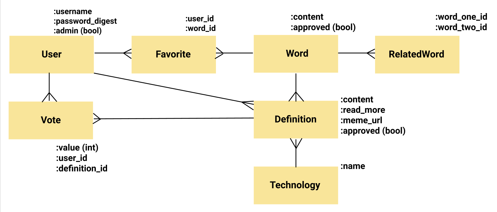

# The Code-Bending Dictionary
---

The Code Bending Dictionary is an initiative aiming to help new code learners (code benders) in befriending tech vocab. We focus on general programming terms, or those relating to Ruby, Rails, JS, React, or Redux.

The dictionary was an idea of **The Code Benders Cohort** of Flatiron School's Immersive Software Engineering Program, and was developed initially as a part of Ruby and Ruby on Rails lectures. 

---
## Table of contents
- [Getting Started](#getting-started)
    - [Node Installation on OS X](#node-installation-on-os-x)
    - [Node Installation on Linux](#node-installation-on-linux)
    - [Node Installation on Windows](#node-installation-on-windows)
- [Installation](#installation)
- [Start and Watch](#start-and-watch)
- [Domain Model](#domain-model)
- [Languages and tools](#languages-and-tools)
- [Contributing](#contributing)
    - [Known Issues](#known-issues)
    - [Core Team](#core-team)
    - [Contributors](#contributors)
- [License](#license)

## Getting Started
For development, you will only need Ruby on Rails and Postgres, which depends on Homebrew and Ruby. 

#### Node installation on OS X

You will need to use a Terminal. On OS X, you can find the default terminal in
`/Applications/Utilities/Terminal.app`.

1. Install [Homebrew](http://brew.sh/):

    ```
    $ ruby -e "$(curl -fsSL https://raw.githubusercontent.com/Homebrew/install/master/install)"
    ```

2. Install [Ruby](https://www.ruby-lang.org/en/):
```
    $ brew install rbenv ruby-build
    # Add rbenv to bash so that it loads every time you open a terminal
    $ echo 'if which rbenv > /dev/null; then eval "$(rbenv init -)"; fi' >> ~/.bash_profile
    $ source ~/.bash_profile

    # Install Ruby
    $ rbenv install 2.7.1
    $ rbenv local 2.7.1
    $ ruby -v
```
3. Install [Rails](https://rubyonrails.org/)
```
    $ gem install rails -v 6.0.2.2
```

4. Install [PostgreSQL](https://www.postgresql.org/)
```
    $ brew install postgresql
```

#### Node installation on Linux

Go on [official Rails website](https://gorails.com/setup/ubuntu/19.10) & follow the steps.

#### Node installation on Windows

Go on [official Rails website](https://gorails.com/setup/windows/10) & follow the steps.

## Installation

1. Clone the repo and cd into the folder:
```
    $ git clone https://github.com/sylwiavargas/The-Code-Bending-Dictionary.git
    $ cd The-Code-Bending-Dictionary
```
2. Install dependencies (gems)
```
    $ bundle
```
3. Create migrations, migrate and seed:
```
    $ rails db:create
    $ rails db:migrate
    $ rails db:seed
```

## Start and Watch

```
    $ rails s
```

Running rubocop with no arguments will check all Ruby source files in the current directory:
```
rubocop
```
You can also run RuboCop in an auto-correct mode, where it will try to automatically fix the problems it found in your code:
```
rubocop -a
```

***

## Domain model



## Languages and Tools

- [Ruby on Rails](https://rubyonrails.org/) 
- [PostgreSQL](https://www.postgresql.org/) - database
- [Active Record](https://guides.rubyonrails.org/active_record_basics.html) - Object Relational Mapping system

## Contributing
Please read our [wiki on contributing]( https://github.com/sylwiavargas/The-Code-Bending-Dictionary/wiki/3.-Contributing-to-the-Code-Bending-Dictionary) and [code of conduct](https://github.com/sylwiavargas/The-Code-Bending-Dictionary/wiki/2.-Code-of-Conduct). 

For major changes, please open an issue first to discuss what you would like to change. 

### Known issues
Visit [issues](https://github.com/sylwiavargas/The-Code-Bending-Dictionary/issues) section.

### Core Team
<table>
  <tr>
    <td align="center"><a href="https://github.com/sylwiavargas">
      <br /><sub><b>Sylwia Vargas</b></sub></a><br />
      <a href="https://github.com/sylwiavargas/The-Code-Bending-Dictionary/commits?author=sylwiavargas" title="Code">💻</a> 
      <a href="https://github.com/sylwiavargas/The-Code-Bending-Dictionary/issues/created_by/sylwiavargas" title="Bug reports">🐛</a>
      <a href="https://github.com/sylwiavargas/The-Code-Bending-Dictionary/issues?q=assignee%3Asylwiavargas" title="Fixes">🛠</a>
      <a href="#infra-sylwia" title="Infrastructure (Hosting, Build-Tools, etc)">🚇</a>
      <a href="https://github.com/sylwiavargas/The-Code-Bending-Dictionary/main/README.md" title="Documentation">📖</a>
      <a href="#ideas-sylwia" title="Ideas, Planning, & Feedback">💡</a>
    </td>
    <td></td>
    <td align="center">
      <a href="https://github.com/hyeokjungkim"><br /><sub><b>Eric Kim</b></sub></a><br />
      <a href="https://github.com/sylwiavargas/The-Code-Bending-Dictionary/commits?author=hyeokjungkim" title="Code">💻</a> 
      <a href="https://github.com/sylwiavargas/The-Code-Bending-Dictionary/issues/created_by/hyeokjungkim" title="Bug reports">🐛</a>
      <a href="https://github.com/sylwiavargas/The-Code-Bending-Dictionary/issues?q=assignee%3Ahyeokjungkim" title="Fixes">🛠</a>
      <a href="#infra-eric" title="Infrastructure (Hosting, Build-Tools, etc)">🚇</a>
      <a href="#ideas-eric" title="Ideas, Planning, & Feedback">💡</a>
    </td>
    <td></td>
    <td align="center">
      <a href="https://github.com/bigfishh"><br /><sub><b>Annie Zheng</b></sub></a><br />
      <a href="https://github.com/sylwiavargas/The-Code-Bending-Dictionary/commits?author=bigfishh" title="Code">💻</a> 
      <a href="https://github.com/sylwiavargas/The-Code-Bending-Dictionary/issues/created_by/bigfishh" title="Bug reports">🐛</a>
      <a href="https://github.com/sylwiavargas/The-Code-Bending-Dictionary/issues?q=assignee%3Abigfishh" title="Fixes">🛠</a>
      <a href="#infra-annie" title="Infrastructure (Hosting, Build-Tools, etc)">🚇</a>
      <a href="#ideas-annie" title="Ideas, Planning, & Feedback">💡</a>
    </td>
    <td></td>
    <td align="center">
      <a href="https://www.kleetime.com/"><br /><sub><b>Isabel K. Lee</b></sub></a><br />
      <a href="https://github.com/sylwiavargas/The-Code-Bending-Dictionary/commits?author=isabelxklee" title="Code">💻</a> 
      <a href="https://github.com/sylwiavargas/The-Code-Bending-Dictionary/issues/created_by/isabelxklee" title="Bug reports">🐛</a>
      <a href="https://github.com/sylwiavargas/The-Code-Bending-Dictionary/issues?q=assignee%3Aisabelxklee" title="Fixes">🛠</a>
      <a href="#infra-isabel" title="Infrastructure (Hosting, Build-Tools, etc)">🚇</a>
      <a href="#ideas-isabel" title="Ideas, Planning, & Feedback">💡</a>
    </td>
    </tr>
</table>

### Contributors
Thank you! 
<table>
    <tr>
        <td align="center">
            <a href="https://github.com/naoufalelh"><br/><sub><b>Naoufal El Hassnaoui</b></sub></a><br/>
            <a href="https://github.com/sylwiavargas/The-Code-Bending-Dictionary/commits?author=naoufalelh" title="Code">💻</a> 
            <a href="https://github.com/sylwiavargas/The-Code-Bending-Dictionary/issues?q=assignee%3Anaoufalelh+" title="Bug reports">🐛</a>
            <a href="#ideas-naoufal" title="Ideas, Planning, & Feedback">💡</a>
        </td>
        <td></td>
        <td align="center">
            <a href="https://github.com/GerryLarios"><br/><sub><b>Gerry Larios</b></sub></a><br/>
            <a href="https://github.com/sylwiavargas/The-Code-Bending-Dictionary/commits?author=GerryLarios" title="Code">💻</a> 
            <a href="https://github.com/sylwiavargas/The-Code-Bending-Dictionary/issues?q=assignee%3AGerryLarios+" title="Bug reports">🐛</a>
        </td>
        <td></td>
        <td align="center">
            <a href="https://github.com/ChristyTropila"><br/><sub><b>Christy Tropila</b></sub></a><br/>
            <a href="https://github.com/sylwiavargas/The-Code-Bending-Dictionary/commits?author=ChristyTropila" title="Code">💻</a> 
        </td>
        <td></td>
        <td align="center">
            <a href="https://github.com/panditita"><br/><sub><b>Etzali</b></sub></a><br/>
            <a href="https://github.com/sylwiavargas/The-Code-Bending-Dictionary/commits?author=panditita" title="Code">💻</a> 
        </td>
        <td></td>
    </tr>
    <tr>
        <td align="center">
            <a href="https://github.com/wlcreate"><br/><sub><b>Waverley Leung</b></sub></a><br/>
            <a href="https://github.com/sylwiavargas/The-Code-Bending-Dictionary/commits?author=wlcreate" title="Code">💻</a> 
        </td>
        <td></td>
        <td align="center">
            <a href="https://github.com/jplessey"><br/><sub><b>Juan Lessey</b></sub></a><br/>
            <a href="https://github.com/sylwiavargas/The-Code-Bending-Dictionary/commits?author=jplessey" title="Code">💻</a> 
        </td>
        <td></td>
        <td align="center">
            <a href="https://github.com/ChenyunZhang"><br/><sub><b>ChenYun Zheng</b></sub></a><br/>
            <a href="https://github.com/sylwiavargas/The-Code-Bending-Dictionary/commits?author=ChenyunZhang" title="Code">💻</a> 
        </td>
    </tr>
</table>

## License
[MIT](https://choosealicense.com/licenses/mit/)


